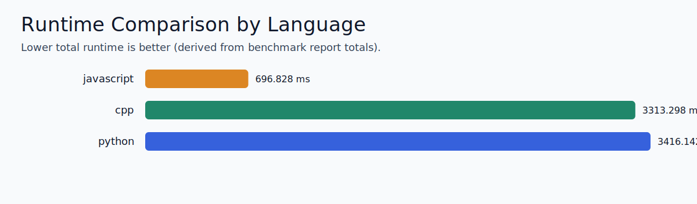
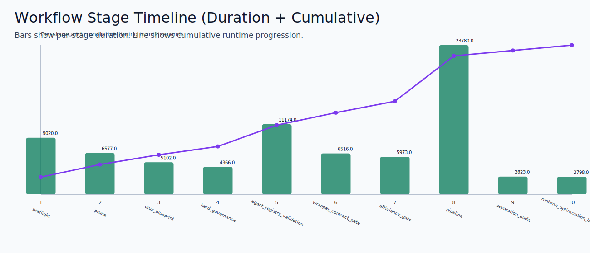
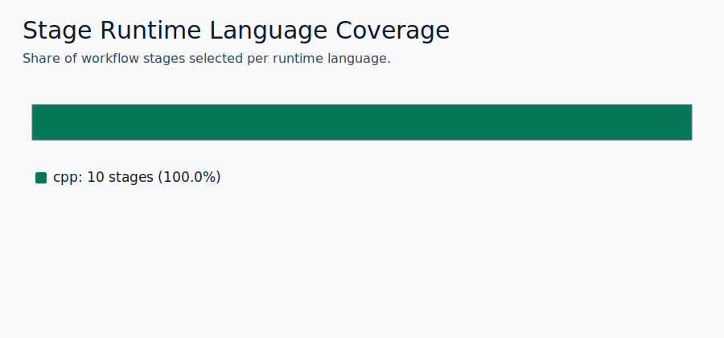
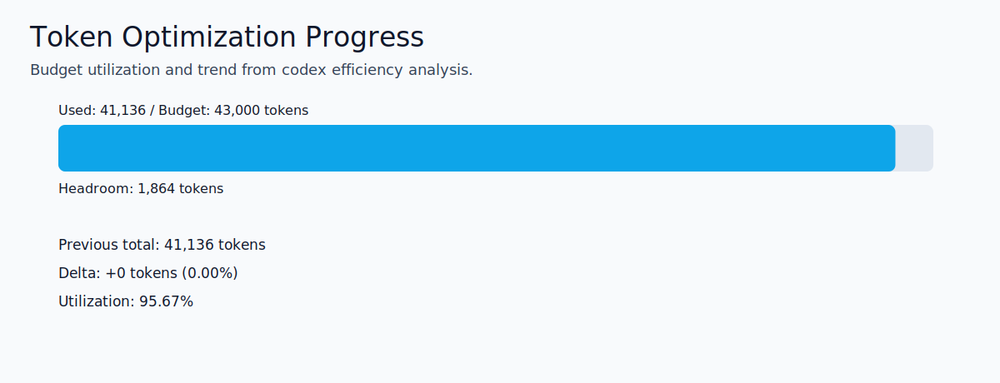
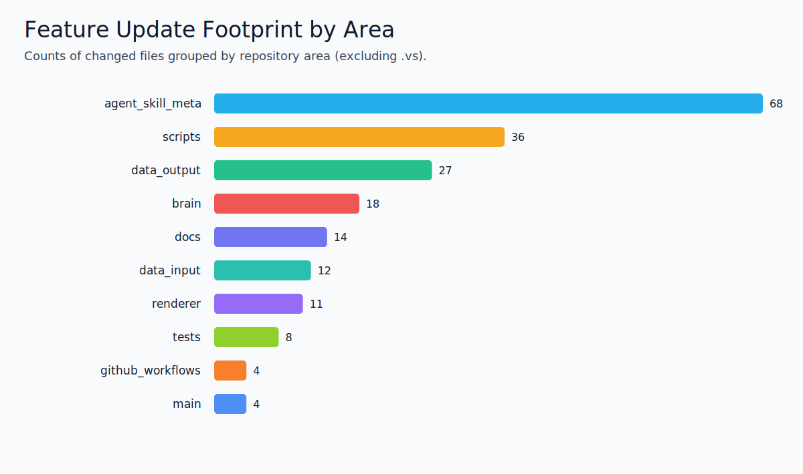
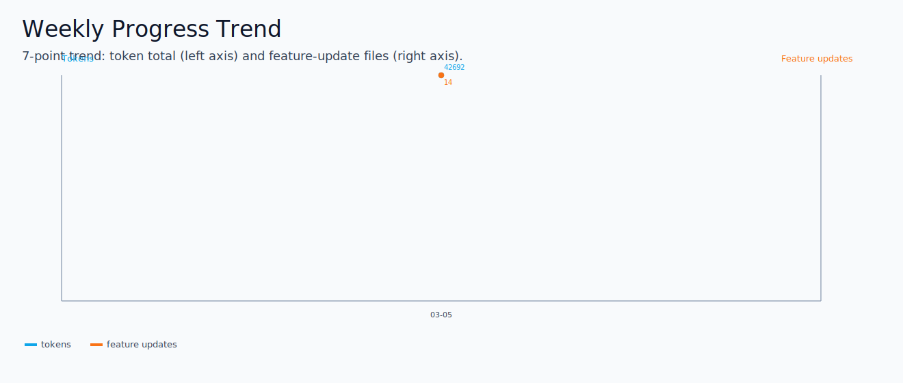

# Runtime Visual Dashboard

- Generated at: 2026-03-05T23:19:38.546Z
- Benchmark report source: `data/output/databases/polyglot-default/reports/polyglot_runtime_benchmark_report.json`
- Script swap source: `data/output/databases/polyglot-default/analysis/script_runtime_swap_report.json`
- Efficiency source: `data/output/databases/polyglot-default/analysis/codex_efficiency_report.json`
- Docs freshness source: `data/output/databases/polyglot-default/analysis/docs_freshness_report.json`
- Overall runtime winner: `javascript`
- Workflow stage count: 10
- Workflow total duration: 12384.000 ms

## Runtime Comparison

| Rank | Language | Total Runtime (ms) |
|---:|---|---:|
| 1 | javascript | 275.063 |
| 2 | cpp | 899.634 |
| 3 | python | 1480.970 |

## Workflow Timeline

| # | Stage | Selected Runtime | Duration (ms) | Status |
|---:|---|---|---:|---:|
| 1 | preflight | javascript | 1353.000 | 0 |
| 2 | prune | javascript | 223.000 | 0 |
| 3 | uiux_blueprint | javascript | 136.000 | 0 |
| 4 | hard_governance | javascript | 326.000 | 0 |
| 5 | agent_registry_validation | javascript | 183.000 | 0 |
| 6 | wrapper_contract_gate | javascript | 148.000 | 0 |
| 7 | efficiency_gate | javascript | 182.000 | 0 |
| 8 | pipeline | javascript | 9584.000 | 0 |
| 9 | separation_audit | javascript | 143.000 | 0 |
| 10 | runtime_optimization_backlog | javascript | 106.000 | 0 |

## Runtime Coverage

| Language | Stage Count |
|---|---:|
| javascript | 10 |

## Token Optimization Progress

- Token budget: 43,000
- Current tokens: 42,692
- Headroom tokens: 308
- Delta vs previous: 0 (0.00%)

## Feature Update Footprint

| Rank | Area | Changed Files |
|---:|---|---:|
| 1 | docs | 8 |
| 2 | data_output | 2 |
| 3 | github_workflows | 1 |
| 4 | scripts | 1 |
| 5 | tests | 1 |
| 6 | agent_skill_meta | 1 |

## Weekly Trend

| Date | Tokens | Feature Updates |
|---|---:|---:|
| 2026-03-05 | 42,692 | 14 |

## Token/Prompt Efficiency Snapshot

- Total tokens estimate: 42,692
- Automation active count: 17
- Skill prompts scanned: 26

_This file is generated by `npm run visuals:runtime`._
